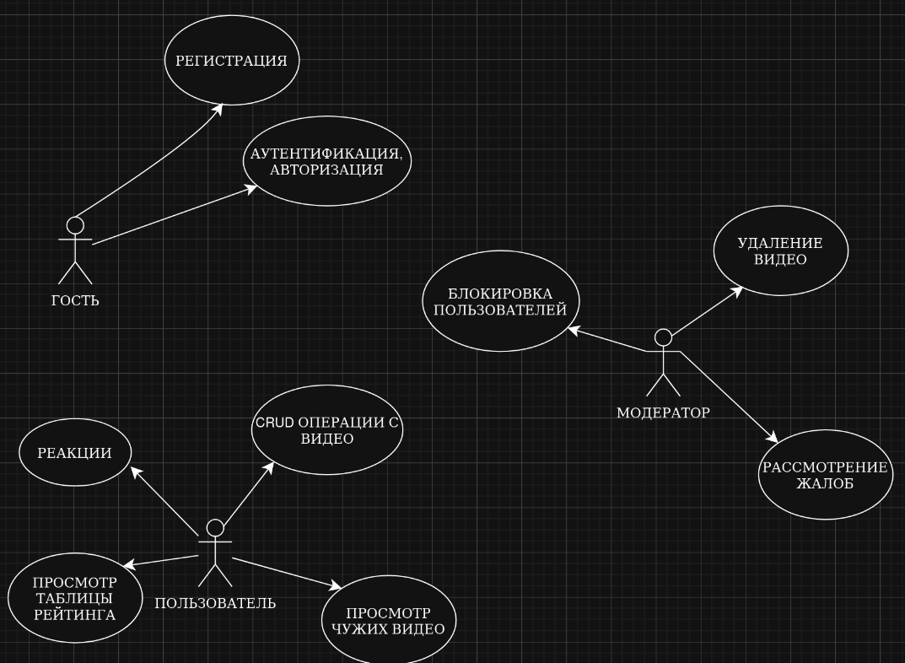
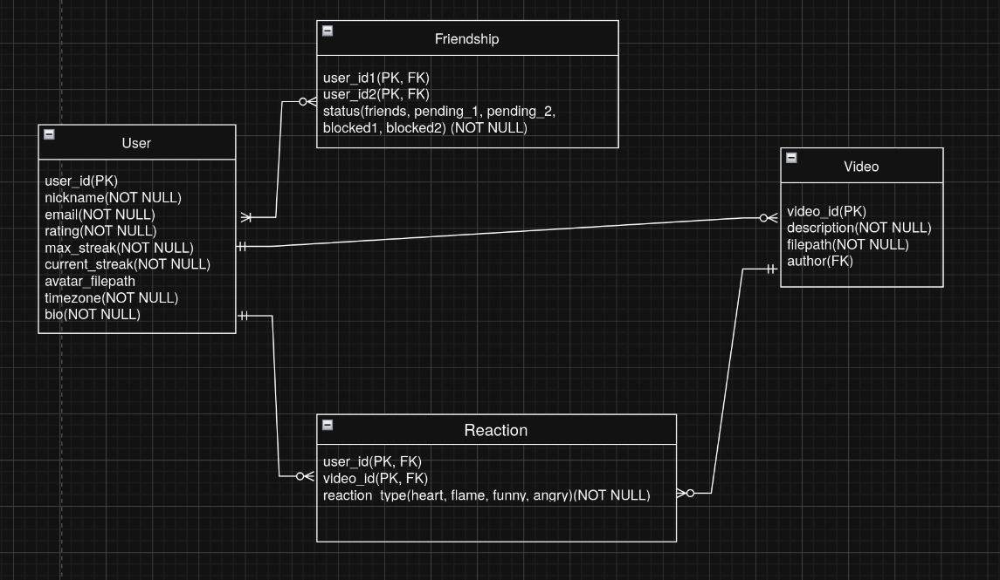

# momentic-backend
Backend of the "Momentic" mobile application - social network, a mixture of TikTok and BeReal.

## 📌 Описание проекта
**Momentic Backend** — серверная часть социального мобильного приложения.  
Задачи backend:
- REST API для мобильного клиента.
- Управление пользователями, ролями и правами.
- Загрузка и хранение видео.
- Реакции (эмодзи, комментарии).
- Рейтинговая система и статистика.
- Авторизация и безопасность (JWT).
- Масштабируемость и контейнеризация.

## 🛠️ Стек технологий
- Язык: **Go (golang 1.21+)**
- Веб-фреймворк: **Gin Router**
- База данных: **PostgreSQL**
- Контейнеризация: **Docker**
- CLI / тестирование API: **curl**
- CDN и защита: **Cloudflare**
- Миграции: **go-migrate**
- Авторизация: **JWT / OAuth2**

## 👥 Роли пользователей и варианты использования

- **Гость**
  - Регистрация / Авторизация.
- **Пользователь**
  - Загружает и публикует видео.
  - Просматривает ленты (друзей и глобальную).
  - Ставит реакции и пишет комментарии.
  - Участвует в рейтинге.
- **Модератор**
  - Просматривает жалобы.
  - Удаляет видео и комментарии.
  - Блокирует пользователей.
- **Администратор**
  - Управляет пользователями и ролями.
  - Настраивает рейтинги и статистику.

### Диаграмма вариантов использования

## ER-диаграмма базы данных

## Ссылка на API сервера
- Базовый URL API: https://api.momentic.app/v1  
- Документация API (OpenAPI/Swagger): https://api.momentic.app/docs

**Ключевые эндпоинты (пример):**
- `POST https://api.momentic.app/v1/auth/login` — авторизация (студ. почта)
- `GET  https://api.momentic.app/v1/feed/global` — глобальная лента
- `GET  https://api.momentic.app/v1/feed/friends` — лента друзей
- `POST https://api.momentic.app/v1/videos` — загрузка видео
- `POST https://api.momentic.app/v1/reactions` — реакция/комментарий
- `GET  https://api.momentic.app/v1/ranking` — рейтинг
- `GET  https://api.momentic.app/v1/users/{id}` — профиль пользователя

## Swagger API Documentation

Данный проект содержит Swagger (OpenAPI) спецификацию для backend-части приложения.  
Файл спецификации: `swaga.yaml`

Swagger используется для документирования REST API, позволяя автоматически создавать интерактивную документацию, клиентские библиотеки и серверные заглушки.

### Как открыть документацию

1. Перейдите по ссылке [https://editor.swagger.io/](https://editor.swagger.io/)
2. Нажмите **File → Import file**
3. Выберите файл `swaga.yaml` (docs/swaga.yaml)
4. Документация появится в правой части экрана.

## Инструкция по сетевому взаимодействию:
- установить cloudflared на сервер, поддерживающий приложение
- воспользоваться командой `cloudflared tunnel --url http://localhost:8080` для подключения туннеля cloudflare. При использовании этой команды cloudflare предоставит временный бесплатный домен, с которым впоследствии можно взаимодействовать при помощи любого устройства с доступом в сеть Internet. Запросы пользователя будут преобрабатываться сервером cloudflare, а позже пересылаться на порт 8080 вашего сервера.
